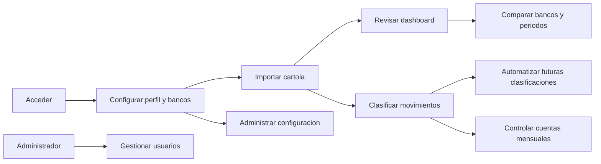

# MisFinanzas: auditoria de User Journeys por Job

Fecha de recorrido: 13 de julio de 2026
Entorno visual: produccion (`https://finanzas-blue-nu.vercel.app`)
Etapa: MVP en desarrollo
Plataformas: escritorio, tablet y movil responsive

## Objetivo

Comprobar que MisFinanzas permite completar los trabajos principales del usuario de principio a fin, tanto en el camino esperado como en condiciones extremas. El recorrido combina pruebas visuales en produccion y lectura del comportamiento implementado para evitar alterar datos reales.

## Estado de reparacion local

Actualizacion: 13 de julio de 2026. Los siete bloqueantes P0 detectados en este recorrido quedaron corregidos y verificados en el entorno local:

| ID | Reparacion aplicada | Verificacion |
|---|---|---|
| P0-01 | Alta multibanco persistida en una sola operacion con banco principal valido. | Compilacion y revision del flujo. |
| P0-02 | Toda seleccion explicita de periodo prevalece sobre la sugerencia automatica. | Pruebas unitarias de mes actual y mes anterior. |
| P0-03 | Recuperacion de contrasena, confirmacion de envio, cambio de clave y enlace invalido. | Revision visual responsive y compilacion. |
| P0-04 | Pagina 404 recuperable con acceso a inicio o dashboard. | Recorrido visual local. |
| P0-05 | RUT visible, editable y accesible desde los enlaces de configuracion. | Revision de ruta, ancla y guardado. |
| P0-06 | Fechas de saldo inicial interpretadas en hora local, sin desplazamiento UTC. | Pruebas unitarias de fecha. |
| P0-07 | El estado vacio de Cuentas abre directamente el configurador existente. | Revision del flujo y compilacion. |

Validacion final local: 14 pruebas aprobadas, lint sin errores y build de produccion correcto. El envio real del correo de recuperacion requiere que Supabase tenga autorizada la URL `/reset-password` del dominio de despliegue.

### Fase de seguridad y recuperacion

| ID | Estado local | Cambio aplicado |
|---|---|---|
| P1-01 | Corregido | Los errores frecuentes de autenticacion se traducen y entregan un siguiente paso. |
| P1-04 | Corregido | Banco, categoria y regla requieren confirmacion contextual; borrar cuenta exige escribir `ELIMINAR`. |
| P1-07 | Corregido | `/audit` fue retirado de las rutas y del bundle publico. |
| P1-08 | Corregido | La validacion inicial y las rutas diferidas muestran un shell de carga estable. |
| P1-09 | Preparado | Las migraciones dejaron de ejecutarse al navegar y se trasladaron a `supabase/migrations/20260713000000_normalize_legacy_data.sql`. Debe aplicarse antes del despliegue. |

Las escrituras de bancos, categorias y reglas ahora actualizan la interfaz solo despues de que Supabase confirma el cambio. El borrado de cuenta utiliza una unica funcion RPC para evitar eliminaciones parciales desde el navegador.

## Leyenda de evidencia

| Marca | Significado |
|---|---|
| Ejecutado | Recorrido completo o parcial realizado en produccion. |
| Asistido | Comportamiento verificado en interfaz y codigo, sin ejecutar una escritura real. |
| No ejecutado | Se detuvo antes de crear, editar, importar, pausar o eliminar datos reales. |
| Bloqueado | La herramienta de QA no permitio completar el paso, aunque la interfaz estaba disponible. |

## Actores y estados

| Actor o estado | Necesidad principal |
|---|---|
| Visitante | Entender el valor, registrarse o iniciar sesion. |
| Usuario nuevo sin verificar | Confirmar su correo y retomar el alta. |
| Usuario verificado sin bancos | Elegir bancos, banco principal y completar datos base. |
| Usuario sin movimientos | Saber que hacer primero y cargar una cartola. |
| Usuario con un banco | Revisar su periodo, clasificar y controlar cuentas. |
| Usuario con varios bancos | Alternar entre banco individual y consolidado sin perder contexto. |
| Usuario con muchos movimientos | Encontrar, filtrar, explicar y corregir informacion con rapidez. |
| Usuario pausado | Entender por que no puede entrar y como recuperar el acceso. |
| Administrador | Supervisar cuentas y realizar acciones sensibles con seguridad. |

## Mapa general de Jobs

## Resumen de cobertura

| Job | Happy path | Extreme path | Resultado |
|---|---|---|---|
| J1. Acceder y recuperar cuenta | Ejecutado | Ejecutado / Asistido | Con brechas |
| J2. Crear cuenta y completar primer inicio | Asistido | Ejecutado / Asistido | Riesgo bloqueante |
| J3. Elegir banco y alcance | Ejecutado | Ejecutado / Asistido | Con brechas |
| J4. Importar una cartola | Ejecutado hasta selector / Asistido | Asistido / Bloqueado | Parcial |
| J5. Entender la situacion financiera | Ejecutado | Ejecutado | Con brecha critica de periodo |
| J6. Encontrar y corregir transacciones | Ejecutado sin guardar | Ejecutado | Bueno con ajustes |
| J7. Automatizar clasificaciones | Ejecutado en estado vacio / Asistido | Asistido | Parcial |
| J8. Controlar cuentas mensuales | Ejecutado | Ejecutado | Funcional |
| J9. Configurar bancos, saldo, RUT, categorias y reglas | Ejecutado sin guardar | Ejecutado / Asistido | Con brechas |
| J10. Navegar en responsive y teclado | Ejecutado | Ejecutado | Bueno con ajustes |
| J11. Administrar usuarios | Ejecutado sin acciones destructivas | Asistido | Bueno con ajustes |
| J12. Auditoria tecnica | Ejecutado | Ejecutado | No debe ser journey publico |

---

## J1. Acceder y recuperar la cuenta

**Job:** Cuando vuelvo a MisFinanzas, quiero entrar con seguridad para continuar donde quede.

### Happy path recorrido

1. Abrir una ruta protegida sin sesion.
2. Ser redirigido a `/login`.
3. Ingresar credenciales validas.
4. Llegar al dashboard autenticado.
5. Mantener la sesion al navegar entre Dashboard, Transacciones, Cuentas y Configuracion.

**Resultado:** Ejecutado. La proteccion de rutas y la persistencia de la sesion funcionan.

### Extreme paths recorridos

| Escenario | Evidencia | Resultado |
|---|---|---|
| Credenciales invalidas | Se ingreso un usuario ficticio. | Falla: se muestra `Invalid login credentials` sin traduccion ni ayuda. |
| Contrasena de registro demasiado corta | Se probaron cinco caracteres. | Falla: se muestra `Password should be at least 6 characters.` en ingles. |
| Campos vacios | Validacion nativa del formulario. | Correcto, pero depende del mensaje propio del navegador. |
| Usuario olvida su contrasena | Busqueda visual y en `Login.tsx`. | Falla: no existe recuperacion de contrasena para el usuario. |
| Usuario pausado | Verificado en `ProtectedRoute` y perfil. | Asistido: existe bloqueo, pero no se probo pausando una cuenta real. |
| URL desconocida | Se abrio `/ruta-inexistente`. | Falla: pagina completamente en blanco; no hay ruta `*`. |
| Inicio lento o error de perfil | `AuthProvider` oculta todo hasta resolver sesion y estado. | Riesgo de pantalla blanca sin feedback (`src/contexts/AuthContext.tsx:53-82`). |

### Solucion recomendada

- Traducir errores de Supabase mediante un mapa de mensajes y ofrecer una accion de recuperacion.
- Incorporar `Olvide mi contrasena`, confirmacion de envio y estado de enlace vencido.
- Agregar una ruta 404 con regreso al dashboard o login.
- Mostrar una pantalla de arranque estable mientras se valida la sesion.

## J2. Crear cuenta y completar el primer inicio

**Job:** Cuando decido usar la aplicacion, quiero crear mi cuenta y dejarla lista sin tener que entender la estructura interna.

### Happy path recorrido

1. Cambiar de `Iniciar sesion` a `Registrarse`.
2. Ingresar correo y contrasena.
3. Recibir la indicacion de verificar correo.
4. Al volver autenticado, elegir uno o mas bancos.
5. Definir banco principal.
6. Completar RUT para detectar transferencias propias.
7. Llegar a un dashboard sin datos con siguiente paso claro.

**Resultado:** Interfaz y codigo recorridos. No se creo una cuenta real ni se envio correo.

### Extreme paths recorridos

| Escenario | Resultado |
|---|---|
| Correo invalido o duplicado | El mensaje depende directamente de Supabase y puede aparecer en ingles. |
| Cero bancos elegidos | El boton queda deshabilitado y existe aviso. Correcto. |
| Varios bancos elegidos | **Bloqueante:** el guardado secuencial usa estado anterior; puede persistir solo parte de la seleccion. Evidencia en `src/pages/Login.tsx:76-89` y `src/contexts/BankContext.tsx:120-149`. |
| Omitir bancos | La interfaz permite continuar, pero luego el usuario depende de estados vacios y configuracion. |
| RUT invalido | Se informa el error. Correcto. |
| No entregar RUT | El modal no tiene cierre. Es una decision fuerte y debe explicarse como requisito antes, no sorprender despues del login. |
| Volver despues de verificar correo | No existe una pantalla clara para reenviar verificacion o cambiar el correo. |

### Solucion recomendada

- Guardar bancos y principal en una sola operacion atomica: `saveBankSetup(selectedBanks, mainBank)`.
- Convertir el alta en una secuencia corta con progreso: Cuenta, Bancos, Datos base, Primera cartola.
- Explicar antes de pedir el RUT por que se solicita, donde se guarda y como se puede editar despues.
- Agregar reenvio de verificacion y cambio de correo.

## J3. Elegir banco y alcance consolidado

**Job:** Cuando tengo varias cuentas, quiero ver un banco o todos sin perder el contexto al cambiar de seccion.

### Happy path recorrido

1. Abrir el selector lateral.
2. Elegir Scotiabank.
3. Ver que dashboard y totales se recalculan para ese banco.
4. Elegir `Todos los bancos`.
5. Ver totales consolidados y desglose por banco.
6. Navegar a Transacciones y Cuentas manteniendo el alcance global.

**Resultado:** Ejecutado. El alcance persiste y las transacciones muestran columna Banco en modo consolidado.

### Extreme paths recorridos

| Escenario | Resultado |
|---|---|
| Banco sin movimientos en el periodo | Estado vacio recuperable. Correcto. |
| Todos los bancos, pero solo uno tiene datos | El consolidado funciona, aunque algunos textos siguen diciendo `este banco`. |
| Cambiar rapidamente de banco | El proyecto cancela resultados asincronos tardios en Cuentas y Transacciones. Correcto. |
| Abrir otra seccion | La seleccion global se conserva. Correcto. |
| Eliminar el banco activo | Asistido: se elige reemplazo, pero la accion de quitar banco es inmediata y sin deshacer. |

### Solucion recomendada

- Adaptar microcopy a `este alcance` o `los bancos seleccionados`.
- Pedir confirmacion antes de desconectar un banco y explicar que ocurre con sus movimientos.
- Mostrar siempre banco y periodo en modales de detalle.

## J4. Importar una cartola

**Job:** Cuando descargo una cartola, quiero cargarla, confirmar que fue interpretada correctamente y agregar solo los movimientos deseados.

### Happy path recorrido

1. Abrir `Importar cartola`.
2. Ver formatos admitidos y selector de archivo.
3. Cerrar y cancelar el flujo sin perder contexto.
4. Detectar banco, confirmarlo, revisar vista previa y guardar.

**Resultado:** Apertura y cancelacion ejecutadas. Deteccion, vista previa y guardado verificados por codigo. La carga de archivo fue bloqueada por una limitacion del navegador de QA, que no admite adjuntar archivos locales.

Se dejo una cartola ficticia reutilizable en `tests/fixtures/qa-import-scotiabank.csv` para el siguiente recorrido manual.

### Extreme paths recorridos

| Escenario | Resultado |
|---|---|
| Archivo de banco no conectado | Antes de mostrar la vista previa, el flujo agrega el banco y cambia el activo (`src/components/ImportModal.tsx:639-653`). Es una consecuencia demasiado temprana. |
| Archivo TXT | El selector acepta `.txt`, pero el arrastre no (`src/components/ImportModal.tsx:890-898` y `:935`). |
| CSV sin encabezados esperados | Existen mensajes de parseo. Asistido. |
| PDF protegido | Existe solicitud de clave y mensaje especifico. Asistido. |
| Archivo vacio o formato desconocido | Hay estado de error y posibilidad de cancelar. Asistido. |
| Duplicados o importacion repetida | La interfaz no anticipa claramente cuantos seran omitidos antes del guardado. |
| Cerrar durante procesamiento | El boton se deshabilita, pero falta comunicar que etapa esta ejecutandose. |

### Solucion recomendada

- Ordenar el flujo: Archivo -> Banco detectado -> Vista previa y duplicados -> Confirmacion final -> Agregar banco y guardar.
- Unificar formatos admitidos entre picker, drag-and-drop y microcopy.
- Mostrar resumen antes de guardar: nuevos, duplicados, errores y banco destino.
- Usar progreso por etapa para PDF/Excel grandes.

## J5. Entender la situacion financiera

**Job:** Cuando abro la aplicacion, quiero entender cuanto entro, cuanto salio y que requiere mi atencion.

### Happy path recorrido

1. Abrir el dashboard consolidado.
2. Revisar balance, ingresos, egresos e inteligencia.
3. Cambiar a un banco individual y confirmar nuevos totales.
4. Abrir el detalle de una categoria.
5. Ver fecha, banco, descripcion y monto.
6. Alternar categorias principales y secundarias.
7. Abrir analisis avanzado solo al solicitarlo.

**Resultado:** Ejecutado. La divulgacion progresiva del estado del banco y analisis avanzado funciona.

### Extreme paths recorridos

| Escenario | Resultado |
|---|---|
| Hoy sin movimientos | Estado vacio con CTA para volver a julio. Correcto. |
| Mes pasado con datos | **Falla alta:** la seleccion vuelve automaticamente al mes actual cuando este supera el umbral. Causa en `src/pages/Dashboard.tsx:317-346`. |
| Periodo personalizado | Selector disponible y persistente. Correcto. |
| Todos los bancos | Totales, desglose y columna Banco funcionan. |
| 1.371 movimientos | La primera carga tarda varios segundos; el esqueleto evita parte del salto visual. |
| Analisis avanzado | En el entorno probado demoro cerca de diez segundos en aparecer. |
| Categoria sin datos | Modal vacio recuperable. Correcto. |

### Solucion recomendada

- Aplicar el periodo automatico solo antes de la primera eleccion del usuario. Cualquier seleccion explicita, incluido `Mes pasado`, debe quedar protegida.
- Reservar alturas estables para inteligencia y graficos.
- Cargar analisis avanzado al abrirlo y mostrar progreso o skeleton local.
- Corregir textos de alcance singular en consolidado.

## J6. Encontrar y corregir transacciones

**Job:** Cuando un movimiento esta mal descrito o clasificado, quiero encontrarlo y corregirlo sin abandonar la lista.

### Happy path recorrido

1. Buscar `PAC AGUA`.
2. Limpiar la busqueda con X.
3. Filtrar por periodo, tipo, estado y banco.
4. Abrir el selector de categoria.
5. Revisar sugerencias contextuales o navegar el arbol.
6. Abrir `Crear nueva` desde el mismo flujo.
7. Abrir division de movimiento, revisar suma y cancelar.

**Resultado:** Ejecutado sin guardar cambios. El selector es comprensible y mantiene al usuario en contexto.

### Extreme paths recorridos

| Escenario | Resultado |
|---|---|
| Busqueda sin resultados | Estado vacio disponible. Correcto. |
| Texto largo | Se trunca en lista, conservando detalle original. Correcto con oportunidad de tooltip. |
| Clasificacion inexistente | Se puede crear dentro del selector. Correcto. |
| Division que no suma el total | Guardar permanece deshabilitado y muestra diferencia. Correcto. |
| Vista consolidada | Se muestra Banco en cada movimiento. Correcto. |
| Lista de 1.371 registros | Carga aproximada de cuatro segundos en movil. Requiere paginacion o virtualizacion perceptible. |
| Movil | Las fichas no desbordan, pero el campo editable de descripcion puede medir solo 18 px de alto. |
| Categorizacion masiva antigua | El codigo conserva modo `bulk`, pero no hay entrada visible; es superficie muerta. |

### Solucion recomendada

- Aumentar el area tactil del campo editable a 44 px sin agrandar visualmente toda la fila.
- Virtualizar o paginar la lista y conservar filtros en URL.
- Eliminar el modo masivo antiguo o integrarlo formalmente al Asistente.
- Mostrar nombre completo de clasificacion mediante tooltip o detalle accesible.

## J7. Automatizar clasificaciones

**Job:** Cuando se repiten comercios o transferencias, quiero que MisFinanzas proponga una clasificacion explicable y la recuerde si yo lo decido.

### Happy path recorrido

1. Abrir `Asistente Inteligente`.
2. Revisar razon, confianza, cantidad, monto y bancos.
3. Ajustar la categoria propuesta.
4. Elegir `Aplicar y recordar`, `Solo esta vez` u `Omitir`.
5. Corregir un movimiento individual dentro de un grupo.

**Resultado:** En la cuenta probada no quedaban pendientes, por lo que se ejecuto el empty state. El resto se verifico por codigo sin aplicar escrituras.

### Extreme paths recorridos

| Escenario | Resultado |
|---|---|
| Todo clasificado | Empty state y re-escaneo visibles. Correcto. |
| Regla existente | Prioridad y confianza 96%. Asistido. |
| Transferencia repetida | Detecta recurrencia, persona y RUT cuando existen. Asistido. |
| Comercio probable | Usa heuristicas explicables. Asistido. |
| Baja confianza | Se mantiene revisable y no se aplica automaticamente. Correcto. |
| Contacto detectado | Resuelto el 13-07-2026: la sugerencia permite revisar nombre, RUT y alias, guardar en `known_contacts` y crear la regla reutilizable sin salir del asistente. |
| Re-escaneo | Es una accion de escritura; no se ejecuto sobre datos reales. |

### Solucion recomendada

- Separar visualmente `Aplicar a este grupo` de `Crear regla futura` y explicar alcance.
- Mostrar ejemplos de movimientos afectados antes de confirmar una regla.
- Evitar reescribir todas las reglas mediante borrado e insercion completa; actualizar solo la regla modificada.

## J8. Controlar cuentas mensuales

**Job:** Cuando llega un nuevo mes, quiero saber que cuentas ya pague, cuales faltan y que transaccion respalda cada estado.

### Happy path recorrido

1. Abrir `Cuentas` con alcance Todos los bancos.
2. Revisar pagadas y pendientes de julio.
3. Abrir Agua y ver el movimiento vinculado, banco, fecha y monto.
4. Expandir historial mensual usado para estimar la fecha.
5. Cambiar a junio y comprobar el recuento del periodo.
6. Abrir configuracion, editar una cuenta y cancelar.

**Resultado:** Ejecutado. Julio mostro 4 pagadas y 8 pendientes; junio 7 pagadas y 5 pendientes. La asociacion exacta por tipo, categoria principal y subcategoria funciona.

### Extreme paths recorridos

| Escenario | Resultado |
|---|---|
| Cuenta sin historial | Muestra `Sin historial`. Correcto. |
| Cuenta pendiente con historial | Muestra fecha estimada y pago anterior. Correcto. |
| Movimiento mal asociado | El detalle permite identificarlo y ofrece `Corregir`. Correcto. |
| Cuenta sin coincidencia exacta | No se marca pagada aunque la descripcion se parezca. Correcto y explicable. |
| Pago manual | Formulario abre y cancela. No se guardo una transaccion real. |
| Cero cuentas configuradas | **Falla alta:** `Crear cuentas` navega a `#gastos-fijos`, seccion inexistente (`src/pages/Accounts.tsx:411-415`). |
| Movil | Sin desborde; el pago anterior se trunca, pero el detalle completo esta disponible. |

### Solucion recomendada

- Hacer que el empty state abra directamente `FixedExpensesConfigModal`.
- Mantener el criterio exacto y mostrar siempre `Por que se marco asi`.
- En `Corregir`, volver al detalle tras reclasificar y actualizar el estado sin recargar toda la pagina.
- Deshabilitar `Guardar pago manual` hasta tener fecha, monto valido y banco.

## J9. Configurar bancos, saldo, RUT, categorias y reglas

**Job:** Cuando cambia mi situacion financiera, quiero ajustar la configuracion sin enfrentar todos los controles a la vez.

### Happy path recorrido

1. Abrir Configuracion.
2. Expandir el panel de estado y luego solo la seccion necesaria.
3. Revisar bancos conectados y banco principal.
4. Revisar o editar saldo inicial.
5. Crear o editar categoria.
6. Crear o editar regla.

**Resultado:** Ejecutado sin guardar. La divulgacion progresiva reduce la carga visual.

### Extreme paths recorridos

| Escenario | Resultado |
|---|---|
| Accion `RUT propio` | **Falla alta:** apunta a `#deteccion`, pero no existe esa seccion (`src/pages/Settings.tsx:182-188`). |
| Editar RUT despues del onboarding | No hay una superficie visible para revisarlo o cambiarlo. |
| Privacidad del RUT | El modal dice que se usa `de manera local`, pero se guarda en Supabase. Microcopy incorrecta. |
| Saldo inicial | **Falla alta:** se muestra 31-12-2024 y el editor abre 2025-01-01 por parseo UTC (`src/components/InitialAdjustmentManager.tsx:98` y `:246`). |
| Categoria vacia | El formulario puede parecer no responder; la validacion no queda anclada al campo. |
| Regla vacia | Igual: mensaje global o no visible, sin `aria-invalid`. |
| Eliminar categoria o regla | La eliminacion es inmediata y sin deshacer. |
| Eliminar cuenta | Solo usa una confirmacion nativa, menos robusta que Administracion. |
| 112 reglas | Todas se renderizan al expandir, aumentando carga y scroll. |

### Solucion recomendada

- Crear una seccion real `Datos personales y deteccion` con RUT editable, explicacion de almacenamiento y estado.
- Tratar fechas `YYYY-MM-DD` como fecha local, no mediante `new Date(date)` en UTC.
- Usar errores inline, foco al primer error y `aria-describedby`.
- Confirmar o permitir deshacer eliminaciones.
- Agregar busqueda y paginacion/colapso a reglas.

## J10. Navegar en responsive y teclado

**Job:** Cuando uso computador, tablet o telefono, quiero mantener las mismas tareas y entender siempre donde estoy.

### Happy path recorrido

1. Revisar Dashboard, Transacciones, Cuentas, Configuracion y Administracion en 1440, 768 y 390 px.
2. Abrir menu movil.
3. Cerrar con Escape.
4. Confirmar retorno de foco al boton que abrio el menu.
5. Revisar que no exista scroll horizontal.

**Resultado:** Ejecutado. No se encontro desborde horizontal en las pantallas principales.

### Extreme paths recorridos

| Escenario | Resultado |
|---|---|
| Menu movil + Escape | Cierra y devuelve foco. Correcto. |
| Tablas en tablet | Cambian a fichas antes de desbordar. Correcto. |
| Texto largo | En general trunca o envuelve; requiere tooltip en clasificaciones. |
| Area tactil | Corregido localmente: iconos informativos, ranking, tabs, selector de periodo e input editable alcanzan al menos 44 px. |
| Login con teclado | Corregido y verificado localmente: flechas, Home y End cambian pestana, actualizan foco y mantienen el patron roving tabindex. |
| Menu movil con teclado | Corregido localmente: Escape devuelve el foco y Tab queda contenido dentro del menu abierto. |
| Configuracion de saldo inicial | Corregido localmente: el encabezado completo es un unico boton accesible, sin controles anidados. |
| Safe areas | Menu movil contempla safe area inferior. Correcto. |

### Solucion recomendada

- Mantener una auditoria automatizada de objetivos tactiles al agregar controles nuevos.
- Ejecutar la regresion final restante en 430 y 1024 px antes del despliegue.

## J11. Administrar usuarios

**Job:** Cuando administro el producto, quiero revisar usuarios y ejecutar acciones sensibles sin equivocarme.

### Happy path recorrido

1. Abrir Administracion con la cuenta autorizada.
2. Revisar totales y lista de usuarios.
3. Buscar un usuario y limpiar la busqueda.
4. Abrir edicion de nombre/RUT y cancelar.
5. Abrir eliminacion, comprobar que exige escribir `ELIMINAR` y cancelar.

**Resultado:** Ejecutado sin modificar usuarios. La eliminacion tiene un resguardo apropiado.

### Extreme paths recorridos

| Escenario | Resultado |
|---|---|
| Busqueda sin resultados | Empty state correcto. |
| Usuario no administrador | Guard visual y RPC de Supabase restringen el acceso. Asistido. |
| Pausar usuario | Confirmacion disponible; no se ejecuto. |
| Reenviar contrasena | Confirmacion disponible; no se envio correo. |
| Eliminar usuario | Doble confirmacion explicita. Correcto. |
| Pausar o eliminar la propia cuenta administradora | La interfaz deshabilita ambas acciones y las RPC vuelven a impedirlas en el servidor. Corregido localmente. |
| Cambiar administrador | El rol queda centralizado en la tabla privada `admin_users`; requiere aplicar la migracion pendiente. |

### Solucion recomendada

- Registrar auditoria de quien ejecuto cada accion y cuando.
- Mantener doble confirmacion para eliminacion y agregar feedback de progreso.

## J12. Auditoria tecnica

**Job interno:** Antes de una migracion, un operador necesita inspeccionar y respaldar datos.

### Recorrido

1. Abrir `/audit` como usuario autenticado.
2. Ver conteo de categorias antiguas.
3. Ver boton de descarga JSON.

**Resultado:** Ejecutado sin descargar. La pantalla esta accesible para cualquier usuario autenticado, no aparece en navegacion y muestra un modelo antiguo de categorias (`src/App.tsx:263`, `src/pages/MigrationAudit.tsx`).

### Solucion recomendada

- Quitarla del bundle de produccion o protegerla con feature flag y rol administrativo.
- Si se conserva, actualizarla al modelo actual y explicar alcance, privacidad y caducidad del respaldo.

---

## Hallazgos priorizados

### Bloqueantes antes de entregar

| ID | Problema | Impacto | Correccion concreta |
|---|---|---|---|
| P0-01 | El onboarding con varios bancos puede guardar una lista incompleta. | Un usuario nuevo empieza con configuracion corrupta o inconsistente. | Persistir seleccion y principal en una sola operacion atomica. |
| P0-02 | `Mes pasado` vuelve al mes actual. | El usuario no puede confiar en el periodo que esta analizando. | Respetar toda seleccion explicita y ejecutar la sugerencia automatica una sola vez. |
| P0-03 | No existe recuperacion de contrasena. | Un usuario bloqueado abandona el producto o requiere soporte manual. | Flujo completo de reset, confirmacion y enlace vencido. |
| P0-04 | Ruta desconocida produce pantalla blanca. | Parece una caida del producto y no ofrece recuperacion. | Agregar 404 y CTA seguro. |
| P0-05 | El RUT no se puede revisar o editar y sus accesos estan rotos. | Transferencias propias pueden quedar mal detectadas sin forma de corregir. | Crear seccion real de datos personales y reparar enlaces. |
| P0-06 | Saldo inicial cambia un dia entre lectura y edicion. | Distorsiona la base temporal de los balances. | Parsear fechas sin conversion UTC. |
| P0-07 | El empty state de Cuentas envia a una seccion inexistente. | Un usuario nuevo no puede crear su primera cuenta desde el CTA principal. | Abrir el modal de configuracion existente. |

### Importantes, no bloqueantes

| ID | Problema | Correccion concreta |
|---|---|---|
| P1-01 | Errores de autenticacion en ingles. | Mapa de errores en espanol con siguiente accion. |
| P1-02 | Importar agrega banco y cambia alcance antes de la vista previa. | Mover efectos a la confirmacion final. |
| P1-03 | Formatos TXT inconsistentes entre selector y drag-and-drop. | Una fuente unica para MIME, extensiones y microcopy. |
| P1-04 | Borrados de banco, categoria y regla no tienen deshacer. | Confirmacion contextual o toast con Undo. |
| P1-05 | El asistente detecta personas, pero no permite crear contacto. | CTA de contacto dentro de la sugerencia. |
| P1-06 | Validaciones de reglas/categorias son poco visibles. | Errores inline y foco al campo. |
| P1-07 | `/audit` queda expuesto y desactualizado. | Retirar o restringir por rol/flag. |
| P1-08 | Pantalla inicial puede quedar blanca mientras valida sesion. | Shell y skeleton de arranque. |
| P1-09 | Migraciones silenciosas se ejecutan desde una ruta de usuario. | Mover migraciones a backend/versionado de datos. |
| P1-10 | Pago manual no comunica con suficiente fuerza campos faltantes. | Estado disabled y errores inline. |

### Estado de reparacion P1 al 13-07-2026

| IDs | Estado | Evidencia |
|---|---|---|
| P1-01, P1-04, P1-07, P1-08 | Resueltos | Errores de acceso traducidos; confirmaciones contextuales; ruta de auditoria retirada; shell de carga incorporado. |
| P1-02, P1-03 | Resueltos | Revisar una cartola ya no conecta ni activa bancos; selector, arrastre y microcopy comparten formatos CSV, TXT, DAT, XLS, XLSX y PDF. |
| P1-05 | Resuelto | El asistente guarda contacto, RUT y alias, y crea una regla reutilizable desde la sugerencia. |
| P1-06 | Resuelto | Categorias y reglas muestran errores inline, detectan duplicados y llevan foco al primer campo pendiente. |
| P1-09 | Codigo listo | La normalizacion se movio a `supabase/migrations/20260713000000_normalize_legacy_data.sql`; falta aplicarla antes del proximo despliegue. |
| P1-10 | Resuelto | El pago manual valida monto, fecha y banco, muestra errores junto al campo y bloquea el guardado incompleto. |

### Mejoras posteriores

| ID | Mejora | Beneficio |
|---|---|---|
| P2-01 | Acotar movimientos y reglas extensas. | Menor espera y scroll mas estable. |
| P2-02 | Precargar bajo demanda el analisis avanzado. | Menor demora percibida. |
| P2-03 | Corregir objetivos tactiles menores a 44 px. | Mejor uso movil y accesibilidad. |
| P2-04 | Completar teclado de tabs en login. | Navegacion accesible consistente. |
| P2-05 | Unificar microcopy de banco individual y consolidado. | Reduce dudas sobre el alcance de los datos. |
| P2-06 | Centralizar roles administrativos. | Menor costo de mantenimiento y menos errores de configuracion. |

### Estado de reparacion UX al 14-07-2026

| IDs | Estado | Evidencia |
|---|---|---|
| P2-03 | Resuelto localmente | Dashboard, Transacciones, Cuentas, Configuracion y Administracion fueron auditados en 390, 820 y 1440 px; no presentan desborde horizontal y se corrigieron los objetivos menores a 44 px detectados. |
| P2-04 | Resuelto localmente | El login implementa navegacion con flechas, Home y End, foco visible y asociacion correcta entre pestana y panel. |
| Progressive disclosure | Mejorado localmente | La explicacion de deteccion en Cuentas queda colapsada por defecto y el ajuste de saldo inicial usa un control expandible unico. |
| P2-02 | Resuelto localmente | El analisis avanzado permanece cerrado por defecto; sus modulos se importan con `lazy` solo al abrirlo y muestran skeleton durante la carga. |
| P2-05 | Resuelto localmente | El alcance individual o consolidado se conserva y se comunica como `Todos los bancos` en Dashboard, Transacciones, Cuentas y Configuracion. |
| P2-01 | Resuelto localmente | Transacciones renderiza 50 movimientos por pagina; Reglas permite buscar y muestra 12 resultados por pagina con estados vacios y controles responsive. |
| P2-06 | Codigo listo | El cliente consume un unico estado `isAdmin` y la migracion `20260714000000_centralize_admin_access.sql` centraliza el rol y las verificaciones del servidor; falta aplicarla en Supabase. |

## Orden recomendado de correccion

1. Estabilidad del primer inicio: P0-01, P0-03, P0-04 y P0-05.
2. Confianza en los datos: P0-02, P0-06 y P0-07.
3. Seguridad de acciones y recuperacion: P1-01, P1-04, P1-07 y P1-09.
4. Importacion y automatizacion: P1-02, P1-03, P1-05 y P1-06.
5. Responsive, accesibilidad y performance percibida: P2-01 a P2-05.

## Limites del recorrido

- No se creo una cuenta nueva ni se envio un correo real.
- No se importaron movimientos ni se guardaron categorias, reglas, pagos manuales o divisiones.
- No se pauso, edito ni elimino ningun usuario.
- No se descargo el respaldo de `/audit`.
- La carga de archivo quedo bloqueada por la herramienta de navegador; el parser se verifico por codigo y se dejo una fixture para QA manual.

Estas restricciones protegen los datos de produccion. Los caminos de lectura, navegacion, filtros, estados vacios, modales, responsive y cancelacion si fueron recorridos en la aplicacion desplegada.
